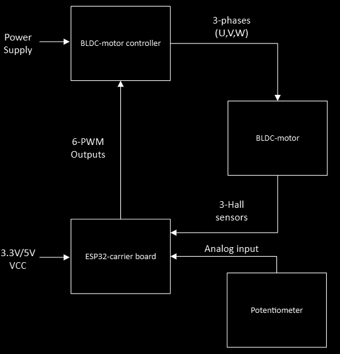
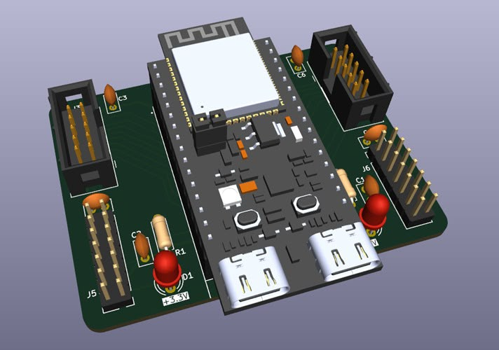
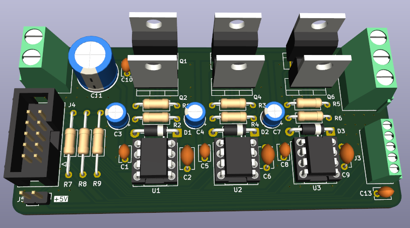

# ESP32-Based BLDC Motor Controller (Firmware & Hardware)

***FI** | **[Lue kattava suomenkielinen dokumentaatio tästä](README_FI.md)***

This repository contains the hardware designs (KiCad) and embedded software (ESP-IDF) for a 3-phase brushless DC (BLDC) motor controller.

The project was developed as part of modernizing the educational equipment in the embedded systems laboratory at SeAMK. The old 8-bit ATmega architecture was upgraded to a modern 32-bit ESP32-C6 platform. The new motherboard was designed to directly support the laboratory's legacy analog and digital input/output expansion boards, preserving compatibility with the existing educational environment.

The firmware has been tested with both a small RC car motor and a larger 750W Vevor electric vehicle motor.

## 🚀 Key Features

* **Hardware:** Two-board design separating 3.3V digital logic from high-power electronics.
* **Firmware:** Event-driven C code built using ESP-IDF and FreeRTOS.
* **Motor Control:** 20 kHz hardware PWM with a 1 µs dead-time to protect the MOSFETs.
* **Performance:** Fast, interrupt-driven 6-step commutation optimized in IRAM.

---

## System Architecture

The system consists of two physical printed circuit boards (PCBs) to electrically isolate the sensitive digital logic from the high-current power electronics.

### Architecture Overview


### 1. ESP32 Carrier Board
Contains the ESP32-C6-based microcontroller, decoupling and bulk capacitors, and the necessary filtering for the power supply.


### 2. BLDC Motor Controller
Contains the 3-phase MOSFET inverter bridge, gate drivers, protection diodes, and bulk and decoupling capacitors for the power input.


---

## 🔌 Pinout Mapping

The physical interface between the software (`include/bldc_control.h`) and the hardware is defined as follows:

| Function | ESP32-C6 Pin | Description / Target on Power Stage |
| :--- | :---: | :--- |
| **PWM U_H / U_L** | GPIO 11 / GPIO 10 | Control for U-phase high- and low-side MOSFETs |
| **PWM V_H / V_L** | GPIO 19 / GPIO 7  | Control for V-phase high- and low-side MOSFETs |
| **PWM W_H / W_L** | GPIO 0 / GPIO 6   | Control for W-phase high- and low-side MOSFETs |
| **Hall U / V / W**| GPIO 5 / GPIO 4 / GPIO 18 | Signal inputs from the motor Hall sensors |
| **Potentiometer** | GPIO 3 (ADC1_CH3)  | Analog voltage input (0–3.3 V) |

---

## 💻 Software Structure and Implementation

The software is written in pure C using the **ESP-IDF (v5.x)** environment and **PlatformIO** tools. The implementation utilizes the FreeRTOS real-time operating system. The software is fully event- and interrupt-driven (no blocking delays), which guarantees accurate motor control even at high rotational speeds.

The code is divided into three logical main components:

### 1. Global Header File and API (`include/bldc_control.h`)
Acts as the hardware definition for the entire system and serves as the public application programming interface (API) for motor control parameters and GPIO definitions. It encapsulates internal helper functions and interrupt handlers away from the main program.

**Low-level critical parameters for motor control:**
* **`PWM_RES_HZ` (10 MHz):** The base clock frequency for the MCPWM module.
* **`PWM_PERIOD` (500):** Defines a 20 kHz PWM frequency ($10\text{ MHz} / 500$). The PWM duty cycle is set between 0 and 500 ticks.
* **`DEAD_TIME_TICKS` (10):** Configures a 1-microsecond hardware dead time between the high- and low-side MOSFETs of each phase to prevent short circuits (shoot-through).
* **GPIO Definitions:** Centralized configurations for the input Hall sensors and power stage transistor outputs.

### 2. Motor Control Logic (`src/bldc_control.c`)
Contains all low-level control logic utilizing the hardware interfaces directly:
* **MCPWM & Dead Time:** Generates the 20 kHz PWM signals for the motor phases and monitors the hardware-level dead time.
* **Interrupt-Driven 6-Step Commutation:** The motor Hall sensors are connected to the MCPWM Capture subsystem. A change in the sensor state triggers an immediate hardware interrupt (`hall_sensor_callback`). To maximize execution speed, the actual commutation function (`update_bldc_commutation`) is placed directly in **IRAM memory**. The code fully supports both forward and reverse commutation sequence tables.
* **FreeRTOS Background Task (`potentiometer_task`):** Handles the potentiometer control and ADC channel processing. It simultaneously calculates the real-time rotational speed from the Hall pulse intervals and filters it using a digital low-pass filter (Exponential Moving Average, $\alpha = 0.10$).

### 3. Main Program (`src/main.c`)
Contains the higher-level application logic. Separate test routines have been built into the file for hardware commissioning:
* **`run_hall_sensor_test()`:** Determines and verifies the sequence and state changes (1–6) of the Hall sensors. The power stage is kept off and the shaft is spun by hand. The order is verified via the serial port, and the motor-specific sequence is updated in the driver's table.
* **`run_speed_ramp_test()`:** Performs an automatic PWM acceleration and braking run to verify the operation of the MOSFET bridges without external interference.
* **Normal Operation (`app_main`):** Runs the main program's `while(1)` loop and tests the code-level direction change sequence (`set_motor_direction`) every 5 seconds.

---

## 📊 Telemetry and Data Visualization

The software outputs real-time data to the serial port every 50 ms. The outputs are formatted using the `>variable:value` standard, allowing direct visualization of the data as a real-time graph using, for example, the **Teleplot** VS Code extension or any Serial Plotter.

**Monitored Variables:**
* `Motor_Duty_Ticks`: PWM pulse width (Counter between 0–500)
* `Hall_State`: Latest state of the Hall sensors (Value between 1–6)
* `Motor_RPM`: Filtered rotational speed (RPM, value is negative when reversing)
* `Motor_Direction`: Direction of rotation (1 = forward, 0 = reverse)

---

## 🛠️ Quick Start

This project is built using **PlatformIO** in VS Code.

```bash
# Clone the repository
git clone https://github.com/paulmikael02/ESP32-BLDC-Motor-Controller.git

# Open in VS Code with the PlatformIO extension installed.
# Build and upload the firmware:
pio run -t upload


