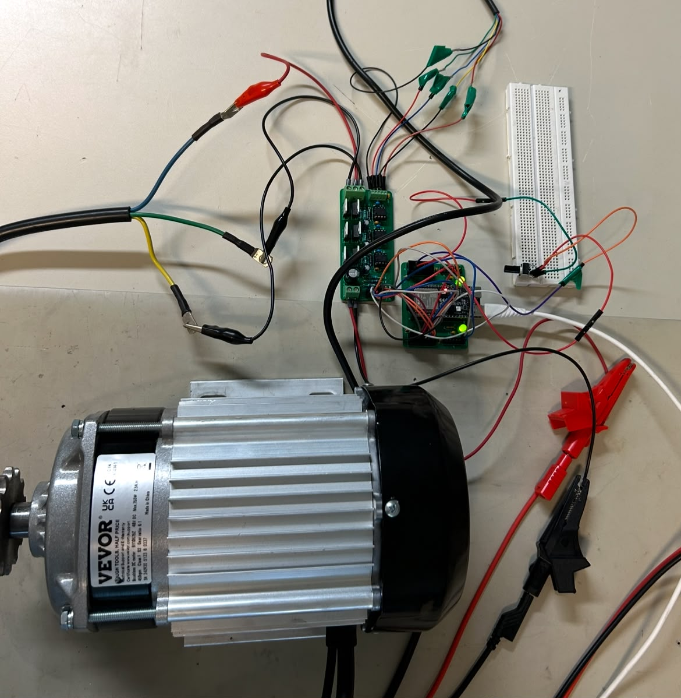
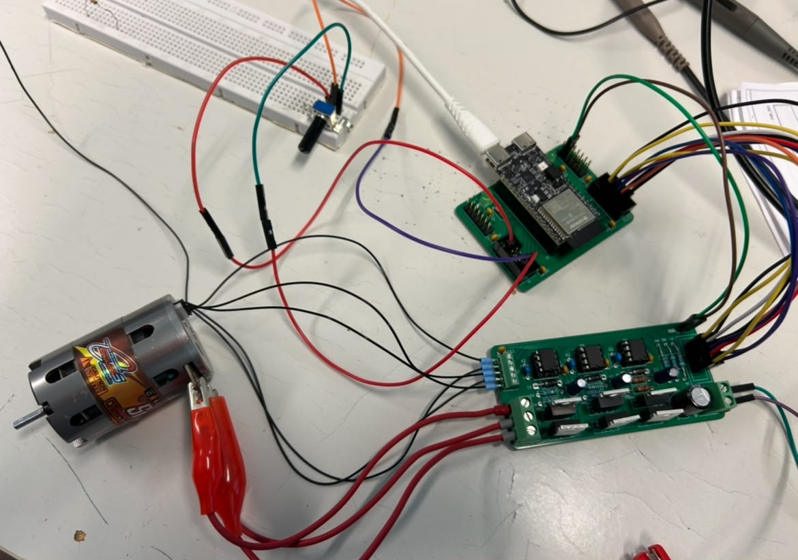

# ESP32-pohjainen BLDC-moottoriohjaus (Firmware & Hardware)

Tämä repositorio sisältää laitteistosuunnitelmat (KiCad) ja sulautetun ohjelmiston (ESP-IDF) 3-vaiheiselle harjattoman tasavirtamoottorin (BLDC) ohjaimelle. 

Projekti on kehitetty osana SeAMK:n sulautettujen järjestelmien laboratorion opetuslaitteiston modernisointia, jossa vanha 8-bittinen ATmega-arkkitehtuuri päivitettiin moderniin 32-bittiseen ESP32-C6-alustaan. Uusi emolevy suunniteltiin tukemaan suoraan laboratorion vanhoja analogisia ja digitaalisia input/output-laajennuskortteja, mikä säilytti olemassa olevan opetusympäristön yhteensopivuuden.

Firmware on testattu sekä pienellä RC-auton moottorilla että suuremmalla 750W Vevor-sähköajoneuvon moottorilla.

---

## Järjestelmäarkkitehtuuri

Järjestelmä koostuu kahdesta fyysisestä piirilevystä, jotta herkkä digitaalilogiikka ja suuriin virtoihin kohdistuva tehoelektroniikka on saatu erotettua sähköisesti toisistaan.

### Yleiskuva arkkitehtuurista


### 1. ESP32 Carrier board
Sisältää ESP32-C6-pohjaisen mikrokontrollerin, decoupling- ja bulk-kondensaattorit sekä tarvittavan suodatuksen teholähteelle.


### 2. BLDC Motor Controller
Sisältää 3-vaiheisen MOSFET-invertterisillan, hilaohjaimet (Gate Drivers), suojadiodit sekä virransyötön bulk- ja decoupling-kondensaattorit.


---

## 🔌 Pinnijärjestys (Pinout Mapping)

Ohjelmiston (`include/bldc_control.h`) ja laitteiston välinen fyysinen liitäntä on määritelty seuraavasti:

| Toiminto | ESP32-C6 Pinni | Kuvaus / Kohde tehoasteella |
| :--- | :---: | :--- |
| **PWM U_H / U_L** | GPIO 11 / GPIO 10 | U-vaiheen ylä- ja alamosfetin ohjaus |
| **PWM V_H / V_L** | GPIO 19 / GPIO 7  | V-vaiheen ylä- ja alamosfetin ohjaus |
| **PWM W_H / W_L** | GPIO 0 / GPIO 6   | W-vaiheen ylä- ja alamosfetin ohjaus |
| **Hall U / V / W**| GPIO 5 / GPIO 4 / GPIO 18 | Moottorin Hall-anturien signaalitulot |
| **Potentiometri** | GPIO 3 (ADC1_CH3)  | Analoginen jännitetulo (0–3.3 V) |

---

## 💻 Ohjelmiston rakenne ja toteutus

Ohjelmisto on kirjoitettu puhtaalla C-kielellä käyttäen **ESP-IDF (v5.x)** -ympäristöä ja **PlatformIO**-työkaluja. Toteutuksessa on hyödynnetty FreeRTOS-reaaliaikakäyttöjärjestelmää. Ohjelmisto on täysin tapahtuma- ja keskeytyspohjainen (ei tukkivia viiveitä), mikä takaa tarkan moottorinohjauksen myös korkeilla pyörintänopeuksilla.

Koodi jakautuu kolmeen loogiseen pääkomponenttiin:

### 1. Globaali otsikkotiedosto ja rajapinta (`include/bldc_control.h`)
Toimii koko järjestelmän laitteistomäärittelynä ja julkisena rajapintana (API) moottoriohjaukseen liittyville parametreille ja GPIO-määritelmille. Se kapseloi sisäiset apufunktiot sekä keskeytyyskäsittelijät piiloon pääohjelmalta.

**Moottorinohjauksen matalan tason kriittiset parametrit:**
* **`PWM_RES_HZ` (10 MHz):** MCPWM-moduulin pohjakellon taajuus.
* **`PWM_PERIOD` (500):** Määrittää 20 kHz PWM-taajuuden ($10\text{ MHz} / 500$). PWM-pulssileveys asetetaan välille 0–500 tickiä.
* **`DEAD_TIME_TICKS` (10):** Asettaa laitteistotasolla 1 mikrosekunnin kuolleen ajan jokaisen vaiheen ylä- ja alamosfetin välille oikosulkujen estämiseksi.
* **GPIO-määritelmät:** Keskitetyt määritykset tulon Hall-antureille ja tehoasteen transistorilähdöille.

### 2. Moottorinohjauslogiikka (`src/bldc_control.c`)
Sisältää kaiken matalan tason ohjauslogiikan suoraan laitteistorajapintoja hyödyntäen:
* **MCPWM & Kuollut aika:** Generoi 20 kHz PWM-signaalit moottorivaiheille ja valvoo laitteistotason kuollutta aikaa.
* **Keskeytyspohjainen 6-vaihekommutaatio:** Moottorin Hall-anturit on kytketty MCPWM Capture -alijärjestelmään. Anturin tilamuutos laukaisee välittömän rautatason keskeytyksen (`hall_sensor_callback`). Nopeuden maksimoimiseksi varsinainen kommutaatiofunktio (`update_bldc_commutation`) on sijoitettu suoraan **IRAM-muistiin**. Koodi tukee täysin eteen- ja taaksepäin suunnattuja kommutaatiotaulukoita.
* **FreeRTOS-taustatehtävä (`potentiometer_task`):** Hoitaa potentiometrin ohjauksen ja ADC-kanavan käsittelyn. Laskee samalla reaaliaikaisen pyörintänopeuden Hall-pulssien aikaväleistä ja suodattaa sen digitaalisella alipäästösuodattimella (Exponential Moving Average, $\alpha = 0.10$).

### 3. Pääohjelma (`src/main.c`)
Sisältää sovelluksen ylemmän tason logiikan. Tiedostoon on rakennettu erilliset testirutiinit laitteiston käyttöönottoa varten:
* **`run_hall_sensor_test()`:** Selvittää ja todentaa Hall-anturien sekvenssin ja tilamuutokset (1–6). Tehoaste pidetään sammuneena ja akselia pyöritetään käsin. Järjestys varmistetaan sarjaportista ja moottorikohtainen sekvenssi päivitetään ajurin taulukkoon.
* **`run_speed_ramp_test()`:** Suorittaa automaattisen PWM-kiihdytys- ja jarrutusajon MOSFET-siltojen toiminnan varmistamiseksi ilman ulkoisia häiriötekijöitä.
* **Normaali ajo (`app_main`):** Pyörittää pääohjelman `while(1)`-silmukkaa ja testaa kooditason suunnanvaihtosekvenssiä (`set_motor_direction`) 5 sekunnin välein.

---

## 📊 Telemetria ja datan visualisointi

Ohjelmisto tulostaa sarjaporttiin reaaliaikaista dataa 50 ms välein. Tulosteet on muotoiltu `>muuttuja:arvo` -standardilla, mikä mahdollistaa datan suoran visualisoinnin reaaliaikaiseksi graafiksi esimerkiksi **Teleplot**-VS Code laajennuksella tai millä tahansa Serial Plotterilla.

**Seurattavat muuttujat:**
* `Motor_Duty_Ticks`: PWM-pulssileveys (Laskuri välillä 0–500)
* `Hall_State`: Viimeisin Hall-anturien tila (Arvo välillä 1–6)
* `Motor_RPM`: Suodatettu pyörintänopeus (RPM, arvo on negatiivinen peruuttaessa)
* `Motor_Direction`: Pyörintäsuunta (1 = eteen, 0 = taakse)

---

## 🚀 Käyttöönotto

1. Avaa tämä projektikansio **VS Code** -ympäristössä, johon on asennettuna **PlatformIO**-laajennus.
2. PlatformIO tunnistaa `platformio.ini`-tiedoston ja lataa tarvittavan ESP-IDF (v5.x) -työkaluketjun automaattisesti taustalla.
3. Käännä koodi ja lataa se kytketylle ESP32-C6-levylle painamalla alareunan nuolikuvaketta tai ajamalla VS Coden terminaalissa komento:
   ```bash
   pio run -t upload

---

## 📸 Testilaitteistot laboratoriossa



